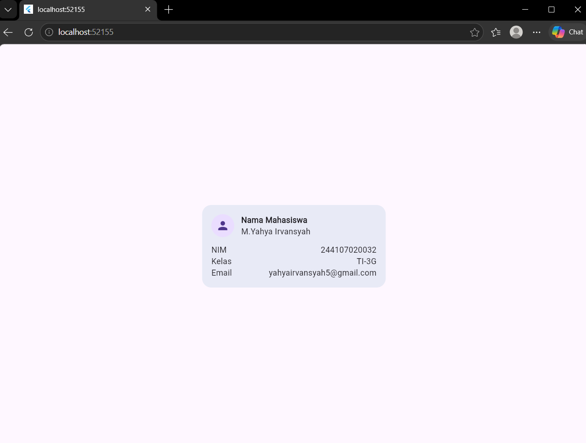
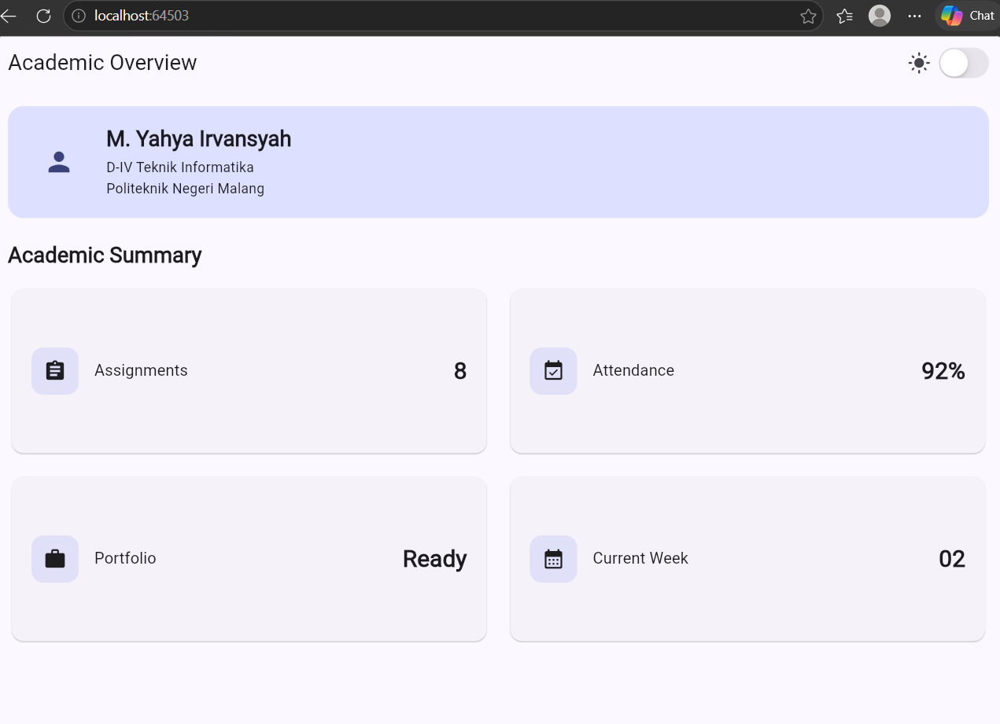
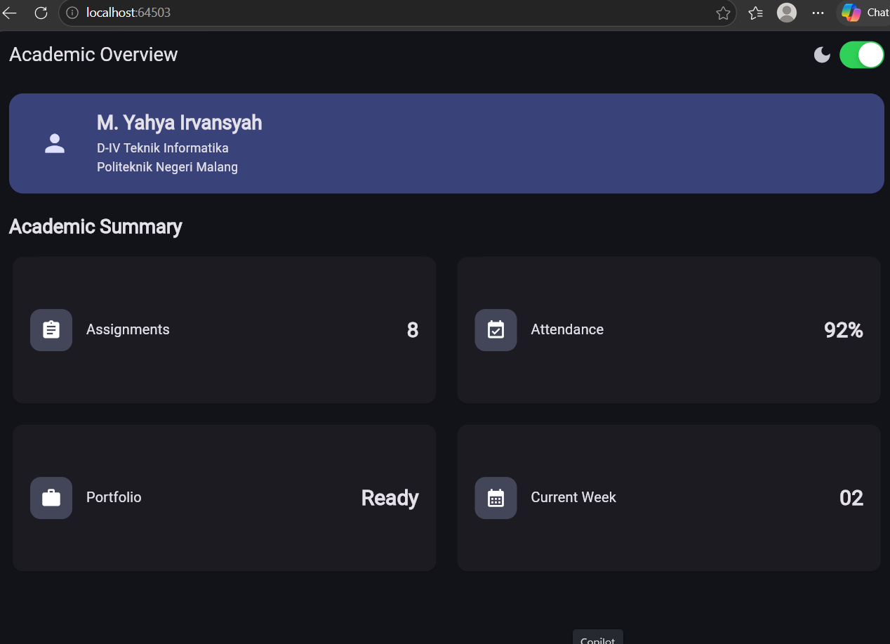

# responsive_dashboard

A new Flutter project.

## Getting Started

This project is a starting point for a Flutter application.

A few resources to get you started if this is your first Flutter project:

- [Learn Flutter](https://docs.flutter.dev/get-started/learn-flutter)
- [Write your first Flutter app](https://docs.flutter.dev/get-started/codelab)
- [Flutter learning resources](https://docs.flutter.dev/reference/learning-resources)

For help getting started with Flutter development, view the
[online documentation](https://docs.flutter.dev/), which offers tutorials,
samples, guidance on mobile development, and a full API reference.

## Hasil Tampilan

### Kartu Identitas Mahasiswa

Tampilan ini menampilkan informasi mahasiswa seperti nama, NIM, kelas, dan email
dalam sebuah kartu yang tersusun rapi.

### Student Dashboard

Dashboard menampilkan ringkasan jumlah tugas, persentase kehadiran, status
portfolio, dan minggu perkuliahan. Tersedia juga toggle untuk mengganti tampilan
antara Light Mode dan Dark Mode.

Ketika tampilan berupa light mode

Ketika tampilan berupa dark mode