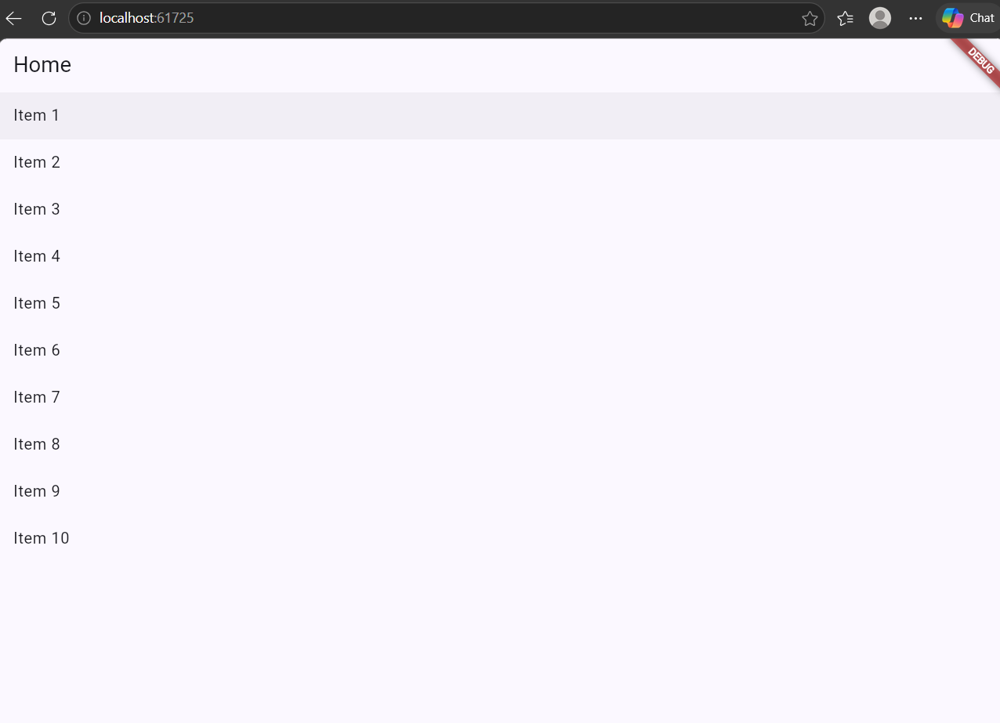
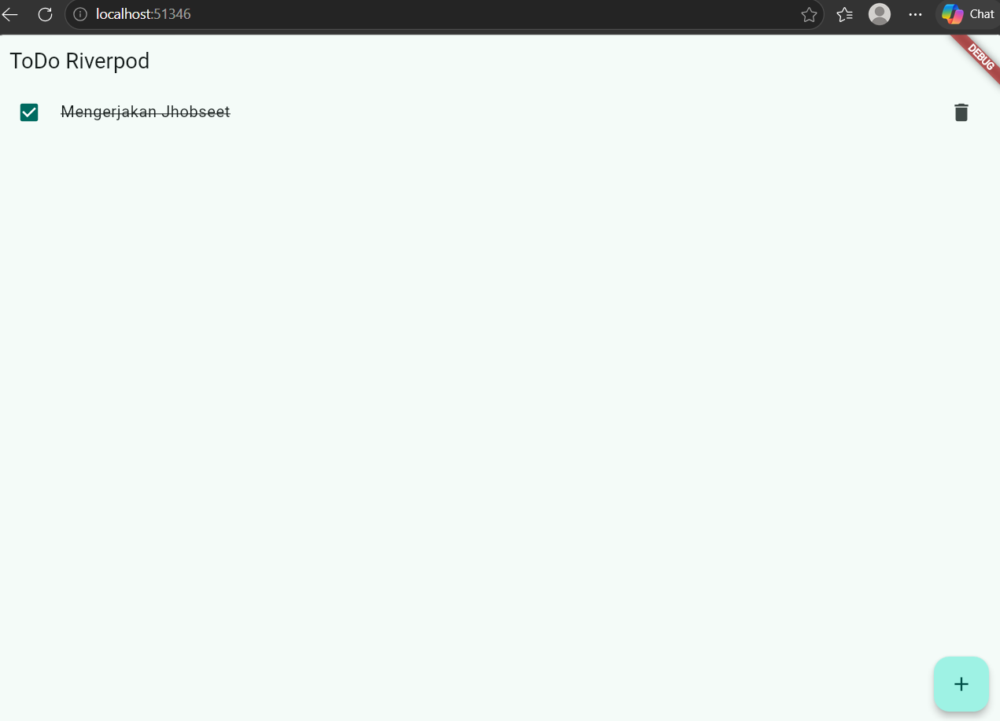
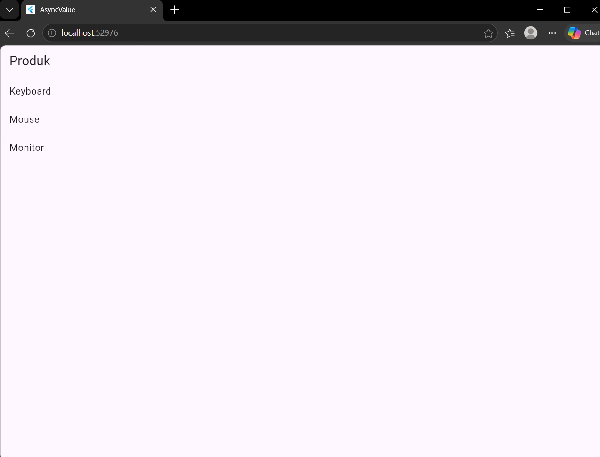
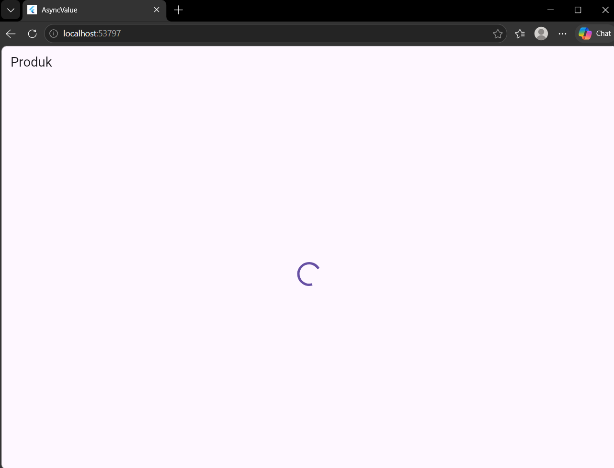
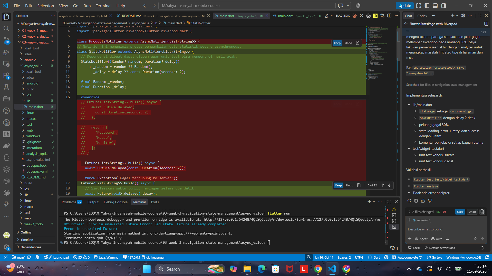
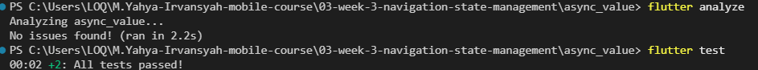
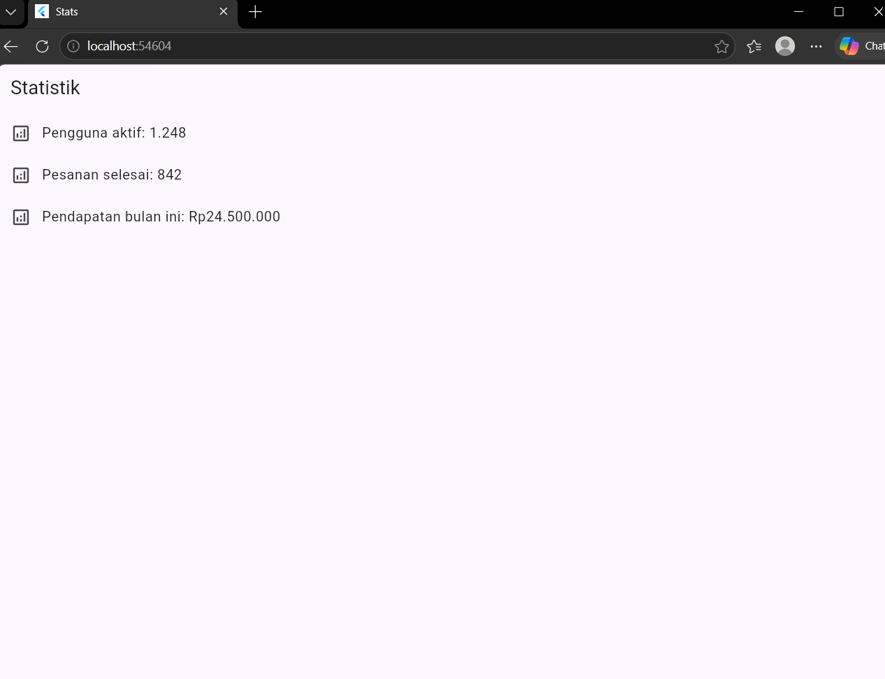
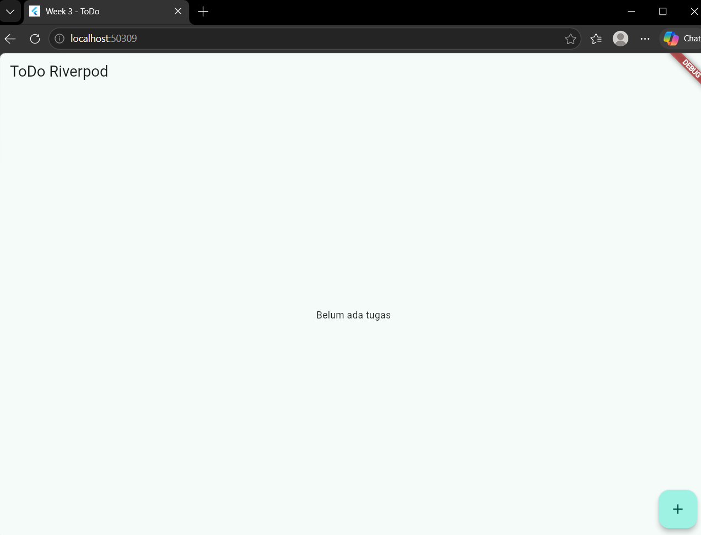
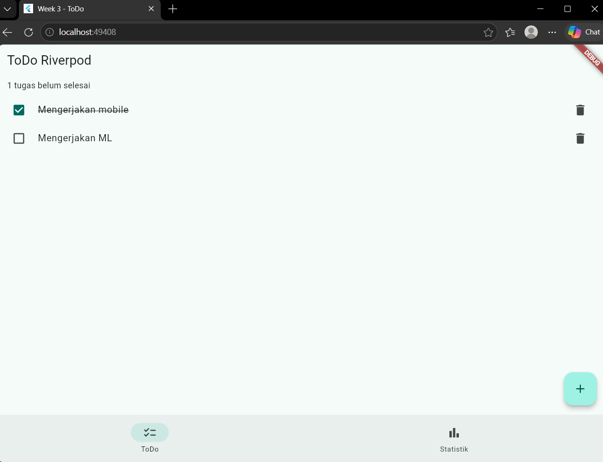
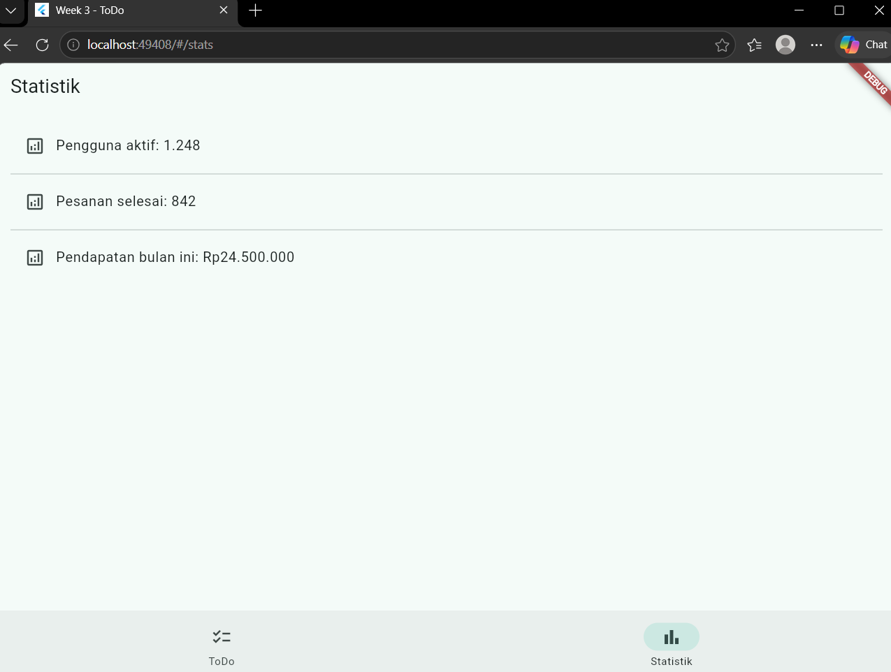

hasil akhit Percobaan awal pembuatan navigation

--------------------------------------------------



membuat halaman otomatis ter-rebuild, dan disini hasilnya adalah halaman seperti to do list yang bisa di gunakan

--------------------------------------------------





Ubah build() sementara untuk melempar error: throw Exception('Gagal terhubung ke server');. Jalankan dan amati UI error beserta tombol Coba lagi.

Menampilkan data lama (stale data) dengan indikator refresh terkadang lebih baik daripada mengosongkan layar karena pengguna masih dapat melihat informasi yang sebelumnya sudah tersedia selama proses pengambilan data baru berlangsung. Hal ini membuat aplikasi terasa lebih cepat dan nyaman digunakan karena pengguna tidak harus menunggu layar kosong sampai data selesai dimuat.

Pola ini penting pada aplikasi yang menggunakan data dari API atau database, seperti aplikasi berita, daftar produk, media sosial, dan dashboard. Dengan tetap menampilkan data lama sambil memberikan indikator bahwa data sedang diperbarui, pengguna tetap dapat menggunakan informasi yang tersedia tanpa terganggu oleh tampilan loading penuh.

--------------------------------------------------

Hasil dari Prompt AI yang saya jalankan


Hasil dari pengecekan 


Hasil UI yang di buat oleh ai

DAN DI BAWAH INI ADALAH HASIL DARI AI DALAM HAL PENJELASAN SOAL DI BAGIAN NOMOR 5 AI CHALLANGE

## Audit Implementasi StatsPage

### 1. Immutable state

Ya. State dikelola oleh `AsyncNotifier<List<String>>` dan data sukses dikembalikan
sebagai list baru dari method `build()`. Tidak ada `state.add()`, `list.add()`,
atau perubahan langsung pada list yang sedang digunakan. Karena data hanya dibaca
oleh UI, tidak diperlukan operasi mutasi. Jika data perlu diperbarui, notifier
sebaiknya mengembalikan list baru, bukan mengubah list lama.

### 2. Penggunaan `ref.watch` dan callback

`ref.watch(statsProvider)` hanya dipakai di dalam `build()` pada `StatsPage`.
Pemakaian ini membuat widget dibangun ulang ketika state provider berubah.

Callback tombol retry tidak memakai `ref.watch`. Callback tersebut memakai
`ref.invalidate(statsProvider)` untuk meminta Riverpod menjalankan ulang provider.
Ini sesuai pola Riverpod: `watch` untuk observasi UI, sedangkan aksi callback
menggunakan operasi imperatif seperti `invalidate` atau `ref.read` bila perlu
memanggil method notifier. Pada implementasi ini `ref.read` tidak diperlukan
karena retry cukup dilakukan dengan invalidasi provider.

### 3. Tiga keadaan `AsyncValue`

Semua keadaan ditangani oleh `statsAsync.when(...)`:

- `loading`: menampilkan `CircularProgressIndicator` saat data sedang diambil.
- `error`: menampilkan pesan error dan tombol `Coba lagi`.
- `data`: menampilkan tiga statistik menggunakan `ListView.builder`.

### 4. Provider eksplisit dan tidak duplikat

Provider dideklarasikan satu kali dengan tipe eksplisit:

```dart
final statsProvider = AsyncNotifierProvider<StatsNotifier, List<String>>(
	StatsNotifier.new,
);
```

Tipe `StatsNotifier` menjelaskan pengelola state, sedangkan `List<String>`
menjelaskan tipe data sukses. Tidak ada provider statistik lain yang duplikat.

### 5. API Riverpod yang digunakan

Implementasi ini menggunakan API Riverpod modern:

- `AsyncNotifier<List<String>>` untuk state asynchronous.
- `AsyncNotifierProvider<StatsNotifier, List<String>>` sebagai provider.
- `ConsumerWidget` untuk membaca provider di dalam widget.
- `WidgetRef` untuk `watch` dan invalidasi provider.

Kode tidak menggunakan `StateProvider` untuk state asynchronous, tidak memakai
`StateNotifierProvider` yang lebih lama untuk kebutuhan ini, dan tidak memiliki
`Consumer` bertingkat yang tidak diperlukan.

## Penjelasan Kode

### `StatsNotifier`

`StatsNotifier` adalah pengelola proses pengambilan statistik. Class ini
memperluas `AsyncNotifier<List<String>>`, sehingga Riverpod otomatis mengubah
hasil `build()` menjadi state `AsyncValue<List<String>>`.

Constructor menerima `Random` dan `Duration` secara opsional. Dalam aplikasi,
default-nya adalah `Random()` dan delay dua detik. Dependensi ini dapat diganti
oleh unit test agar pengujian tidak menunggu dua detik dan hasil acak dapat
dikontrol.

Method `build()` menunggu dua detik untuk mensimulasikan request jaringan.
Kemudian `nextDouble()` dipakai untuk membuat error pada 30% percobaan ketika
nilainya kurang dari `0.3`. Jika tidak gagal, method mengembalikan tiga item
statistik dalam list baru.

### `statsProvider`

`statsProvider` adalah satu-satunya provider pada contoh ini. Riverpod membuat
instance `StatsNotifier` melalui `StatsNotifier.new` dan menyediakan hasilnya
untuk widget yang membacanya.

### `StatsPage`

`StatsPage` adalah `ConsumerWidget`, sehingga menerima `WidgetRef` pada method
`build()`. Baris `ref.watch(statsProvider)` membaca state provider dan membuat
UI merespons perubahan loading, error, atau data.

`statsAsync.when(...)` memetakan setiap keadaan ke tampilan yang sesuai. Pada
keadaan error, `ref.invalidate(statsProvider)` dipanggil oleh tombol retry.
Invalidasi membuang state provider saat ini dan menjalankan kembali proses
`build()` notifier.

Pada keadaan data, `ListView.builder` menampilkan tiga statistik. Setiap item
memakai `ListTile` dan ikon analitik agar informasi mudah dipindai.

### `StatsApp` dan `main()`

`main()` menjalankan aplikasi dengan `ProviderScope`, yaitu scope yang membuat
provider Riverpod tersedia untuk seluruh widget di bawahnya. `StatsApp`
menyediakan `MaterialApp` dan menetapkan `StatsPage` sebagai halaman awal.

### Unit test notifier

File `test/widget_test.dart` menguji notifier secara langsung. Dua implementasi
`Random` palsu membuat hasil pengujian deterministik: `AlwaysSuccessRandom`
menghasilkan `0.5`, sedangkan `AlwaysFailureRandom` menghasilkan `0.1` yang berada
di bawah ambang `0.3`.

Delay diubah menjadi `Duration.zero` hanya pada test. Test pertama memastikan
hasil sukses memiliki tiga item dan berisi statistik pengguna aktif. Test kedua
memastikan notifier melempar `Exception` ketika simulasi request gagal.

## Hasil Validasi

Perintah berikut dijalankan dari folder `async_value`:

```text
flutter analyze
```

Hasil: `No issues found!`

```text
flutter test
```

Hasil: seluruh test lulus tanpa warning analyzer.

-----------------------------------------------


testing aman dan tidak ada  kendala

-----------------------------------------------

7. Tugas, refleksi, dan referensi
Mini project / Industry Challenge
Bangun aplikasi ToDo dengan navigasi dan Riverpod sebagai tugas minggu ini:

Minimal 2 halaman dengan GoRouter: daftar tugas, halaman detail/statistik.
State dikelola Riverpod (Notifier), UI menggunakan ConsumerWidget.
Tambahkan fitur simulasi asinkron dengan AsyncValue: state loading, error, dan success tampil dengan benar.
Sertakan minimal 1 unit/widget test yang lulus.
Kerjakan bagian AI Challenge dan dokumentasikan prompt, hasil AI, perbaikan, serta alasan keputusan teknis Anda.
Push ke repository portfolio pada folder 03-week-3-navigation-state-management/ dengan struktur lib/, test/, README.md, dan screenshots/. README menjelaskan tujuan, fitur utama, stack teknologi, cara menjalankan, dan hasil yang dicapai.


HASIL DARI TUGAS DAN JUGA MINI PROJEKNYA

