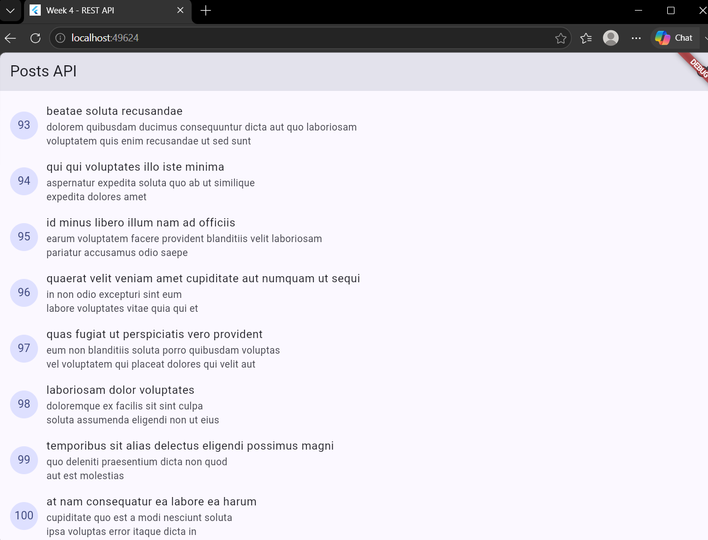
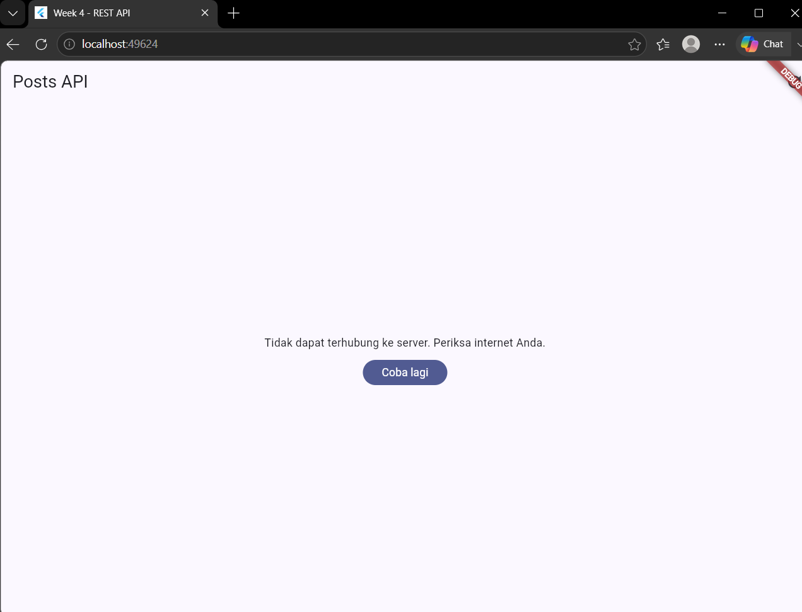
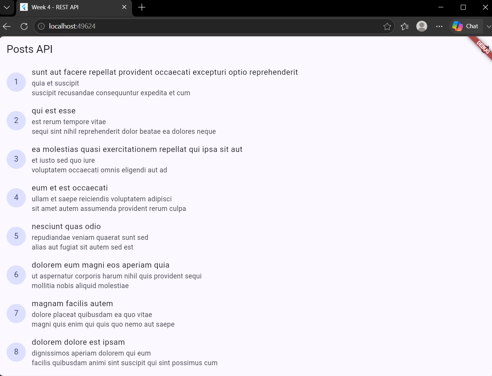
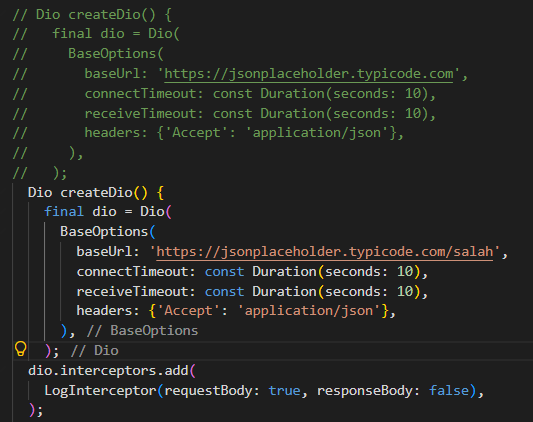
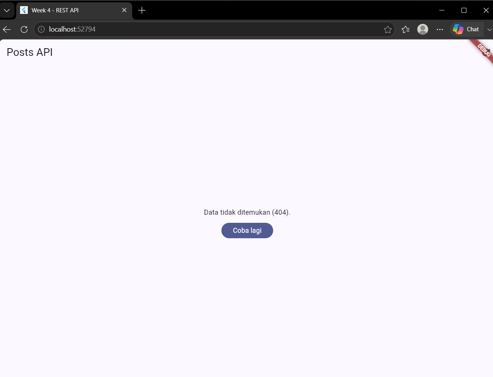
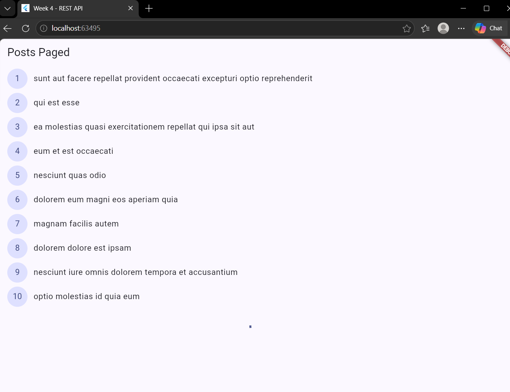
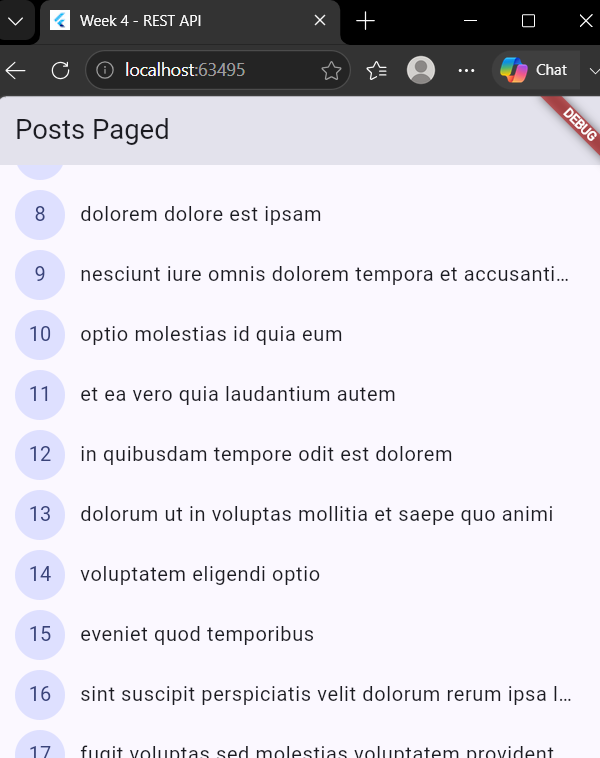
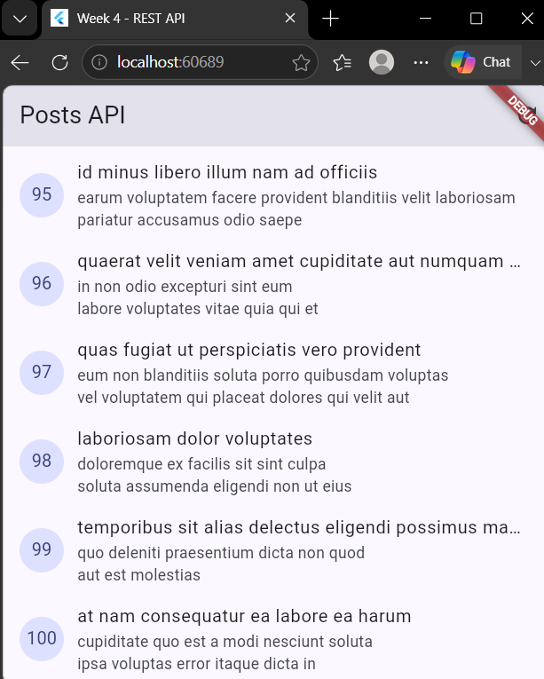
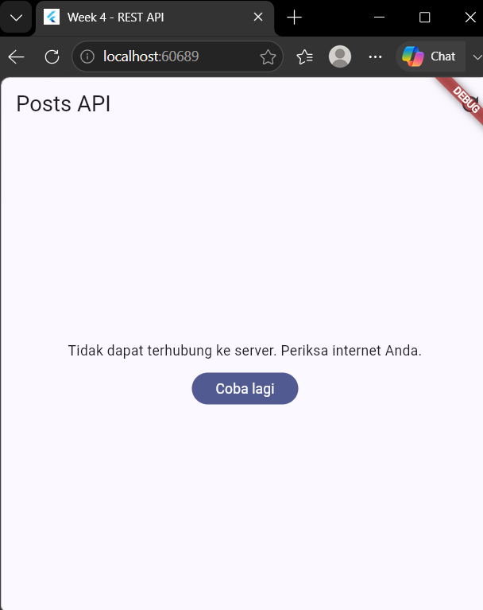

-----------------------

1. Jalankan aplikasi dengan internet normal, amati loading lalu daftar 100 posts.
---------------------------------------------------------------------------------
# Week 4: Networking REST API

Project Flutter ini mengambil data post dari JSONPlaceholder dengan alur:

`UI -> Riverpod Provider -> Repository -> Dio/API`

## Tujuan

Menerapkan networking REST API yang terpisah dari UI, state asynchronous dengan Riverpod, penanganan error yang ramah pengguna, dan pagination dasar.

## Fitur utama

- Mengambil daftar post dari endpoint `/posts`.
- Menampilkan state loading, error dengan tombol retry, empty, dan success.
- Infinite scroll dengan 10 item per halaman.
- Pagination memakai query `_page` dan `_limit`.
- Data halaman sebelumnya tetap tampil saat halaman berikutnya dimuat.
- Guard `isLoadingMore` mencegah request pagination ganda.
- Indikator loading halaman berikutnya dan status semua data telah dimuat.
- Navigasi post ke route `/post/:id`.
- Parsing `Post.fromJson` dengan nilai default untuk field null atau missing.
- Unit test model, error mapping, provider sukses, provider error, dan edge case JSON kosong.

## Teknologi

- Flutter/Dart
- Dio
- flutter_riverpod
- go_router
- JSONPlaceholder REST API

## API dan arsitektur

Konfigurasi Dio dipusatkan di `lib/data/api_client.dart`, termasuk base URL JSONPlaceholder, timeout 10 detik, dan `LogInterceptor`. `PostRepository` memakai Dio dari `dioProvider` dan menyediakan `fetchPosts` serta `fetchPostsPage`.

Halaman utama memakai `postListProvider`. Halaman pagination memakai `pagedPostsProvider`, yang menyimpan item, halaman aktif, status loading, status data berikutnya, dan error.

## Menjalankan project

```bash
cd 04-week-4-networking-rest-api
flutter pub get
flutter run
```

Untuk validasi:

```bash
flutter analyze
flutter test
```

## Hasil

Implementasi Mini Project telah diverifikasi dengan `flutter analyze` tanpa issue dan `flutter test` dengan seluruh test lulus. Dokumentasi proses AI dan koreksi implementasi tersedia di [docs/ai-challenge.md](docs/ai-challenge.md).

- Uji tiga skenario error
-----------------------

1. Jalankan aplikasi dengan internet normal, amati loading lalu daftar 100 posts.
---------------------------------------------------------------------------------


2. Matikan internet (mode pesawat), tekan refresh, amati pesan ramah + tombol Coba lagi. Nyalakan kembali internet, tekan Coba lagi.
------------------------------------------------------------------------------------------------------------------------------------

ketika tombol coba lagi di pencet itu akan tetap sama dan tidak ada perubahan sama sekali


Setelah internet saya nyalahkan kembali itu baru bisa kembali ke mode awal

3. Sementara ubah baseUrl menjadi URL salah, amati pesan error koneksi. Kembalikan setelah uji.
-----------------------------------------------------------------------------------------------


Ketika memang dirubah baseurlnya menjadi url yang salah maka aplikasinya akan eror juga
---------------------------------------------------------------------------------------

- Ubah home di main.dart menjadi PagedPostPage, jalankan, dan scroll sampai bawah. Amati: halaman 1 tampil dulu, indikator muncul, data bertambah tanpa reload penuh.
---------------------------------------------------------------------------------------------------------------------------------------


Ubah home di main.dart menjadi PagedPostPage, jalankan, dan scroll sampai bawah. Amati: halaman 1 tampil dulu, indikator muncul, data bertambah tanpa reload penuh, dan juga disitu akan loading ketika layar tidak memenuhi syarat yang sudah ditentukan sebesar 200 pixel.



nah ini kalau memang udah menyesuaikan syarat yang sudah ada dan akan muncul page selanjutnya ketika di scroll
--------------------------------------------------------------------------------------------------------------

AI Verification Checklist
Sebelum kode AI diterima, verifikasi hal berikut dan catat temuan Anda di README:

1. Apakah UI memanggil Dio secara langsung (dilarang) atau lewat repository?

UI tidak memanggil Dio secara langsung. Pengambilan data dilakukan melalui CommentRepository dan provider Riverpod sehingga terdapat pemisahan antara UI dan akses API.

2. Apakah fromJson aman null, atau masih memakai cast langsung yang bisa crash?

fromJson dibuat aman terhadap field yang hilang atau bernilai null dengan menggunakan nullable cast dan nilai default, sehingga proses parsing tidak langsung menyebabkan crash.

3. Apakah semua tipe DioExceptionType (timeout, connectionError, badResponse) dipetakan ke pesan pengguna?

Error Dio dipetakan menjadi pesan yang lebih ramah pengguna, termasuk timeout, connection error, 404, dan 500.

4. Apakah baseUrl/timeout terpusat di satu client, bukan tersebar di tiap method?

baseUrl dan konfigurasi timeout dipusatkan pada ApiClient sehingga repository hanya menggunakan client yang sudah dikonfigurasi dan tidak membuat konfigurasi Dio secara berulang.

5. Apakah test AI benar-benar menguji kasus field hilang, atau hanya happy path? Tambahkan minimal 1 edge case sendiri.

Test tidak hanya menguji happy path, tetapi juga menguji field yang hilang. Sebagai edge case tambahan, dilakukan pengujian terhadap JSON kosong untuk memastikan fromJson tetap aman.

6. Jalankan flutter analyze dan flutter test, apakah hasil AI lolos tanpa warning?
flutter analyze berhasil tanpa error/warning dan flutter test berhasil dengan seluruh test lulus.
------------------------------------------------------------------------------------------------



Hasil ketika aman dan tidak eror 100 post



Hasil ketika tidak ada internet dan eror 

2. Refleksi

### 1. Mengapa UI tidak boleh memanggil Dio langsung?

UI tidak boleh memanggil Dio langsung karena UI seharusnya hanya mengatur tampilan dan interaksi pengguna. Pada project ini, UI menggunakan provider Riverpod, provider menggunakan `PostRepository`, lalu repository menggunakan Dio. Pemisahan ini membuat kode lebih mudah diuji, dirawat, dan dikembangkan. Konfigurasi seperti base URL, timeout, dan interceptor juga tetap terpusat di `ApiClient`, sehingga tidak tersebar di dalam widget.

### 2. Kapan client-side pagination cukup dan kapan server pagination digunakan?

Client-side pagination cukup ketika jumlah data kecil, data sudah tersedia di perangkat, dan kebutuhan aplikasi hanya menampilkan data secara bertahap untuk mengurangi beban tampilan. Namun, untuk data yang besar atau terus bertambah, server-side pagination lebih tepat karena hanya sebagian data yang dikirim dari server. Project ini menggunakan server pagination melalui parameter `_page` dan `_limit`, sehingga aplikasi hanya meminta 10 post pada setiap halaman dan tidak perlu mengambil seluruh data sekaligus.

### 3. Bagaimana exception repository menjadi `AsyncError`?

`PostRepository` melempar exception ketika request Dio gagal. `PostListNotifier` adalah `AsyncNotifier`, sehingga exception dari method `build()` diteruskan Riverpod sebagai state `AsyncError`. Pada proses refresh, notifier menangkap exception dan mengatur `state = AsyncError(error, stackTrace)`. UI kemudian membaca state tersebut melalui `postsAsync.when()` dan menampilkan pesan dari `friendlyErrorMessage()` serta tombol retry.

### 4. Bagian AI mana yang diperbaiki dan mengapa?

Beberapa hasil awal AI perlu disesuaikan dengan project yang sebenarnya. `FamilyAsyncNotifier` diganti karena tidak tersedia pada versi Riverpod yang digunakan, sehingga notifier comments dibuat kompatibel dengan `AsyncNotifier` dan provider family. Import pada `post_test.dart` diperbaiki dari package yang tidak sesuai menjadi `my_app`, dan helper error diarahkan ke `network_errors.dart`. Penggunaan `valueOrNull` di `main.dart` diganti dengan `whenOrNull` karena API tersebut tidak tersedia pada versi Riverpod project. Selain itu, `PostTile` digunakan dengan callback `context.push('/post/${post.id}')`, sedangkan smoke test bawaan counter diganti agar sesuai dengan aplikasi dan memakai `ProviderScope` tanpa melakukan request jaringan.