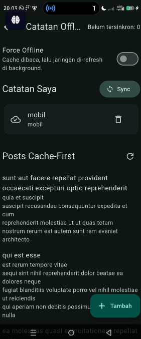
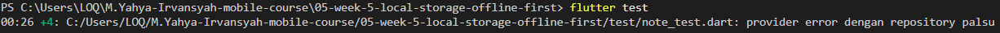

# Week 5 Flutter: Offline Notes

## 1. Ringkasan Masalah

Aplikasi membutuhkan dua jenis penyimpanan:

- Preferensi kecil: `dark_mode` dan `last_opened_at`.
- Data terstruktur: minimal 1000 catatan dengan `title`, `body`, `updated_at`, dan `dirty` untuk antrean sinkronisasi.

Tidak ada satu teknologi yang paling baik untuk semua kebutuhan. Penyimpanan key-value cocok untuk preferensi, sedangkan data catatan membutuhkan query, transaksi, indeks, dan kemungkinan relasi. Project ini saat ini menggunakan `shared_preferences 2.5.5`, `sqflite 2.4.4`, `path 1.9.1`, dan Riverpod 3.4.3. Hive dan Drift belum menjadi dependency project.

Kesimpulan awal yang masih harus diverifikasi dengan eksperimen adalah: SharedPreferences untuk preferensi, lalu sqflite atau Drift untuk catatan. Hive tetap masuk akal jika kebutuhan relasi dan query SQL tidak berkembang.

## 2. Tabel Perbandingan

| Kriteria | SharedPreferences | Hive | sqflite / SQLite | Drift |
|---|---|---|---|---|
| Kompleksitas query | Key-value; tidak ada query/filter/sort antarkoleksi | Query box sederhana dan filter di Dart; bukan SQL relasional | SQL lengkap: `WHERE`, `ORDER BY`, `COUNT`, `JOIN`, indeks | SQL melalui API Dart; query terstruktur dan dapat diketik |
| Relasi antar data | Tidak tersedia | Tidak seperti foreign key relasional; relasi dirakit di aplikasi | Foreign key, `JOIN`, tabel relasional, transaksi | Fitur relasi/query SQLite dengan abstraksi Dart |
| Reaktivitas / Stream | Tidak ada stream perubahan data bawaan | Box dapat menyediakan stream perubahan | Tidak otomatis; buat stream/invalidate provider sendiri | Reactive query/`watch()` menghasilkan Stream |
| Type-safety | Tipe terbatas key-value, bukan schema domain | Model adapter/type id atau map; bergantung konfigurasi | Baris SQL berupa map; tipe query lebih manual | Generated data class dan query lebih type-safe |
| Boilerplate | Sangat sedikit | Sedikit hingga sedang; adapter dan box | Sedang; SQL, mapping, migration manual | Lebih banyak setup awal dan generated code |
| Kemudahan testing | Mudah dengan mock/in-memory abstraction | Mudah bila box dapat diisolasi; setup adapter tetap diperlukan | Baik dengan database test/in-memory, tetapi perlu fixture schema | Baik; database test dan query terisolasi, generated code membantu |
| Data jumlah besar | Tidak dirancang sebagai koleksi besar | Lebih sesuai daripada key-value, tetapi query/indeks berbeda dari SQL | Sangat sesuai untuk 1000+; indeks dan query dijalankan SQLite | Sangat sesuai karena tetap memakai SQLite |
| Offline-first | Bisa menyimpan flag/cache kecil, orkestrasi manual | Cocok untuk cache lokal cepat | Sangat cocok untuk cache, transaksi, dan query | Sangat cocok dengan reactive query dan transaksi |
| Antrean sinkronisasi | Tidak built-in; hanya key-value manual | Tidak built-in; buat box/status sendiri | Tabel `sync_queue` atau `dirty` dan transaksi | Sama seperti SQLite dengan API lebih terstruktur |
| Migrasi schema | Tidak ada schema tabel; perubahan key ditangani aplikasi | Adapter/schema berubah dan kompatibilitas harus dikelola | `version`/`onUpgrade` dan SQL migration manual | Migration API terstruktur, tetapi tetap harus ditulis dan diuji |
| Debugging | Mudah dilihat sebagai key-value | Perlu memahami box, adapter, dan binary/storage format | SQL dapat diinspeksi dengan SQLite tools; error query eksplisit | Query dan schema terstruktur, tetapi generated code menambah lapisan |
| Cocok untuk pemula | Sangat cocok untuk preferensi | Cukup cocok untuk cache sederhana | Cocok untuk belajar database dan SQL | Cocok setelah memahami SQLite; setup awal lebih berat |

Catatan penting: tabel ini membedakan fitur yang tersedia langsung dari package dengan fitur yang masih bisa dibuat sendiri. Semua teknologi dapat dipakai untuk membuat pola offline-first, tetapi tidak semuanya menyediakan query, stream, atau antrean sync sebagai fitur built-in.

## 3. Analisis SharedPreferences

### Cara kerja

SharedPreferences menyimpan pasangan key-value sederhana melalui platform storage. Contoh tipe yang umum adalah `bool`, `int`, `double`, `String`, dan `List<String>`. Aplikasi membaca atau menulis berdasarkan nama key seperti `dark_mode` dan `last_opened_at`.

### Kelebihan

- API kecil dan mudah dipahami.
- Tepat untuk konfigurasi dan preferensi pengguna.
- Tidak membutuhkan schema tabel, SQL, adapter, atau migration database.
- Mudah dibungkus repository dan di-mock saat testing.

### Kekurangan teknis

- Tidak memiliki tabel, indeks, `WHERE`, `ORDER BY`, `JOIN`, atau transaksi domain catatan.
- Daftar catatan harus di-encode sendiri, misalnya satu JSON besar pada satu key. Itu membuat update satu catatan berarti membaca, decode, mengubah, encode, dan menulis seluruh daftar.
- Tidak memiliki stream perubahan catatan bawaan.
- Tidak cocok untuk foreign key, antrean, agregasi `COUNT`, atau konkurensi update yang kompleks.
- Batas ukuran dan perilaku persistence dapat bergantung pada implementasi platform/package; jangan memperlakukan storage ini sebagai database umum.

### Kesesuaian

SharedPreferences cocok untuk `dark_mode = true` dan `last_opened_at = ISO-8601 string`. SharedPreferences tidak cocok untuk CRUD kompleks, relasi, filter dirty, sorting berdasarkan `updated_at`, atau 1000+ catatan sebagai satu koleksi yang terus berubah. Dirty flag dan timestamp secara teknis bisa disimpan sebagai key, tetapi antrean sync harus dirancang seluruhnya oleh aplikasi.

## 4. Analisis Hive

### Cara kerja

Hive adalah database key-value lokal yang menyimpan objek di dalam box. Objek dapat berupa nilai sederhana, map, atau class yang mempunyai adapter. Aplikasi membaca item berdasarkan key, bukan melalui model tabel dan SQL.

### Kelebihan

- Cepat untuk read/write lokal dan cache.
- API sederhana untuk data dokumen/key-value.
- Box dapat memberi notifikasi perubahan melalui stream seperti `watch()` pada API versi yang mendukungnya.
- Catatan dapat dibuat sebagai object dengan adapter sehingga lebih rapi daripada JSON manual di SharedPreferences.
- Tidak memerlukan SQL untuk operasi CRUD dasar.

### Kekurangan teknis

- Query tidak setara dengan SQL relasional. Filter/sort kompleks sering dilakukan di Dart setelah data dibaca, atau membutuhkan indeks/pola data khusus.
- Relasi antar box bukan foreign key dan `JOIN` database; integritas relasi harus dijaga aplikasi.
- Type-safety bergantung pada model dan adapter yang dipakai. Perubahan field/adapter harus dikelola kompatibilitasnya.
- Migrasi data dan perubahan adapter dapat menjadi pekerjaan manual.
- API dan package yang dipilih perlu diperiksa: ekosistem Hive memiliki variasi package/fork dan dokumentasi berbeda menurut versi.
- Antrean sync, retry, dan status server bukan fitur bawaan; perlu box atau field status sendiri.

Hive cocok untuk catatan offline jika bentuk datanya sederhana, relasi tidak banyak, dan tim nyaman mengelola filter/sort di aplikasi. Untuk kebutuhan `COUNT dirty`, sorting timestamp, dan relasi masa depan, SQLite biasanya memberi fondasi query yang lebih jelas.

## 5. Analisis sqflite / SQLite

### Cara kerja dan SQL

`sqflite` adalah plugin Flutter untuk membuka database SQLite dan menjalankan SQL atau helper query. SQLite menyimpan data dalam tabel dan dapat membuat indeks, constraint, transaksi, dan foreign key.

Contoh operasi yang dibutuhkan catatan:

```sql
SELECT * FROM notes ORDER BY updated_at DESC;
SELECT * FROM notes WHERE dirty = 1;
SELECT COUNT(*) FROM notes WHERE dirty = 1;
```

### Kelebihan teknis

- Cocok untuk 1000+ catatan; jumlah tersebut kecil untuk database relasional jika query dan indeks dirancang wajar.
- Mendukung CRUD, sorting, filtering, agregasi, relasi, transaksi, dan indeks.
- `updated_at` dapat disimpan sebagai ISO-8601 `TEXT` yang konsisten atau format timestamp numerik.
- `dirty INTEGER NOT NULL DEFAULT 0` mudah difilter dengan `dirty = 1`.
- Transaksi dapat mengubah catatan dan antrean sync secara atomik.
- Database dapat diinspeksi dengan SQLite browser/tools, sehingga debugging query relatif langsung.

### Kekurangan teknis

- Mapping `Map<String, Object?>` ke model Dart harus ditulis dan dijaga sendiri.
- SQL string tidak sepenuhnya type-safe pada compile time.
- `sqflite` tidak otomatis mengubah query menjadi Stream reactive. Repository/provider harus melakukan reload atau membuat mekanisme notifikasi.
- Migration membutuhkan `version` dan implementasi `onUpgrade`; perubahan schema harus diuji pada database lama.
- Dibanding Drift, helper query, mapping, dan sebagian boilerplate ditulis manual.

### Testing dan dirty flag

Repository dapat menerima `Future<Database> Function()` agar test menyuntikkan database test/in-memory. Test dapat memasukkan row dirty, memanggil `countDirty()`, menjalankan `markAllSynced()`, lalu memeriksa kembali nilai `dirty`. Perlu diingat dukungan database in-memory dan perilaku platform perlu dicek pada versi `sqflite`/`sqflite_common` yang dipakai.

## 6. Analisis Drift

### Hubungan Drift dengan SQLite

Drift bukan database engine yang berbeda dari SQLite. Drift adalah persistence layer/type-safe query builder di atas SQLite. Data tetap disimpan oleh SQLite, sedangkan Drift membuat tabel, data class, query, dan sebagian mapping melalui code generation.

### Kelebihan teknis

- Query dan hasil query lebih type-safe dibanding map SQL mentah.
- `watch()` pada query menyediakan reactive Stream; UI/provider dapat berlangganan perubahan query.
- Generated data class mengurangi mapping manual dan typo nama kolom.
- Mendukung transaksi, relasi, indeks, dan migration SQLite.
- Sangat cocok untuk offline-first yang membutuhkan UI otomatis berubah setelah database berubah.
- Testing query dan database dapat dilakukan dengan database test yang terisolasi.

### Kekurangan teknis

- Setup lebih banyak: tabel Dart, konfigurasi database, code generation, dan build runner sesuai versi package.
- Generated code dapat membuat debugging awal terasa lebih panjang.
- Migration tetap harus dirancang dan diuji; code generation tidak otomatis memahami aturan bisnis migrasi.
- Untuk aplikasi kecil atau pemula yang baru belajar SQL, abstraksinya dapat terasa lebih berat daripada sqflite.

### Perbedaan utama dengan sqflite

Dengan sqflite, developer menulis SQL/helper, mapping row, dan invalidasi state lebih manual. Dengan Drift, schema/query/data class dibuat dalam API Dart dan sebagian dihasilkan otomatis; reactive query lebih dekat dengan fitur bawaan framework. Keduanya tetap menggunakan SQLite dan sama-sama membutuhkan desain migration, indeks, transaksi, serta aturan sync.

## 7. Perbandingan untuk Kebutuhan Preferensi

Untuk data berikut:

```text
dark_mode = true/false
last_opened_at = timestamp
```

SharedPreferences paling sesuai karena datanya kecil, tidak memiliki relasi, tidak membutuhkan query, dan berupa konfigurasi aplikasi. Repository cukup menyediakan `getDarkMode`, `setDarkMode`, `markOpenedNow`, dan `getLastOpened`.

Hive juga bisa menyimpan data tersebut, tetapi box dan modelnya lebih besar daripada kebutuhan. sqflite dan Drift bisa membuat tabel preferences, tetapi itu menambah schema, query, dan migration yang tidak diperlukan untuk dua nilai sederhana.

## 8. Perbandingan untuk Kebutuhan Catatan

Untuk 1000+ catatan, kebutuhan utamanya adalah query terstruktur:

- `CREATE`, `READ`, `UPDATE`, `DELETE`.
- `ORDER BY updated_at DESC`.
- `WHERE dirty = 1`.
- `COUNT(*)` untuk badge antrean.
- Indeks pada `updated_at` dan/atau `dirty` bila pengukuran menunjukkan manfaat.
- Transaksi saat mengubah catatan dan metadata sync.
- Relasi masa depan dengan `users` atau `sync_queue`.

SharedPreferences tidak tepat. Hive dapat menjalankan kebutuhan dasar tetapi query relasional, relasi, dan migration menjadi tanggung jawab aplikasi. sqflite memenuhi kebutuhan langsung dengan SQL dan cocok untuk belajar dasar database. Drift paling kuat jika aplikasi akan berkembang menjadi banyak query reactive, relasi, dan schema migration yang lebih terstruktur.

Untuk project pembelajaran ini, sqflite adalah pilihan pragmatis karena kebutuhan saat ini langsung berupa SQL dan repository sudah tersedia. Drift menjadi alternatif yang layak bila reactive query, generated type-safety, dan pertumbuhan schema lebih penting daripada setup minimal.

## 9. Skema 1000+ Catatan

Skema minimal:

```sql
CREATE TABLE notes(
  id INTEGER PRIMARY KEY AUTOINCREMENT,
  title TEXT NOT NULL,
  body TEXT NOT NULL DEFAULT '',
  updated_at TEXT NOT NULL,
  dirty INTEGER NOT NULL DEFAULT 0
);

CREATE INDEX idx_notes_updated_at ON notes(updated_at);
CREATE INDEX idx_notes_dirty ON notes(dirty);
```

Fungsi kolom:

- `id`: identitas unik dan primary key.
- `title`: judul wajib catatan.
- `body`: isi catatan; default string kosong.
- `updated_at`: waktu perubahan terakhir untuk sorting dan aturan konflik.
- `dirty`: `0` berarti bersih/sudah tersinkron, `1` berarti menunggu sync.

Pengembangan dengan user dan sync queue dapat berbentuk:

```sql
users(
  id INTEGER PRIMARY KEY,
  ...
)

notes(
  id INTEGER PRIMARY KEY,
  user_id INTEGER NOT NULL,
  title TEXT NOT NULL,
  body TEXT NOT NULL,
  updated_at TEXT NOT NULL,
  dirty INTEGER NOT NULL DEFAULT 0,
  FOREIGN KEY(user_id) REFERENCES users(id)
)

sync_queue(
  id INTEGER PRIMARY KEY AUTOINCREMENT,
  entity_type TEXT NOT NULL,
  entity_id INTEGER NOT NULL,
  operation TEXT NOT NULL,
  payload TEXT NOT NULL,
  created_at TEXT NOT NULL,
  retry_count INTEGER NOT NULL DEFAULT 0,
  last_error TEXT
)
```

`sync_queue` lebih fleksibel daripada hanya satu `dirty` flag ketika aplikasi membutuhkan operasi create/update/delete, retry, error, dan urutan pengiriman. Pada SQLite, foreign key juga perlu diaktifkan dan diuji sesuai konfigurasi package/platform.

## 10. Offline-First dan Sync

Arsitektur umum:

```text
UI
 ↓
Provider / State Management
 ↓
Repository
 ↓
Local Storage
 ↓
SQLite / Hive / SharedPreferences
```

### Cache-first

Cache-first berarti repository membaca data lokal dan mengembalikannya secepat mungkin. Jika online, request jaringan berjalan di background. Respons yang berhasil ditulis ke local storage, lalu provider di-refresh atau query reactive memancarkan nilai baru. Jika request gagal, cache lama tidak dihapus.

- SharedPreferences: bisa menyimpan cache kecil sebagai JSON string, tetapi parsing, ukuran, update parsial, dan invalidasi semuanya manual.
- Hive: cocok untuk cache object/key-value dan dapat menggunakan stream box, tetapi query relasional dan konsistensi antarbox harus dirancang sendiri.
- sqflite: cocok untuk cache terstruktur; repository menjalankan query lokal lalu request background dan invalidasi provider secara manual.
- Drift: pola sama dengan sqflite, tetapi `watch()` dapat mengirim hasil baru otomatis setelah tabel berubah.

### Dirty -> Sync -> Clean

1. Saat catatan dibuat/diubah lokal, simpan `dirty = 1` atau masukkan item ke `sync_queue`.
2. Worker/repository mengambil item dirty.
3. Kirim create/update/delete ke server.
4. Jika server menjawab HTTP 2xx, tandai bersih atau hapus item antrean.
5. Jika gagal, pertahankan dirty, naikkan retry, dan simpan error bila diperlukan.

Tidak ada dari empat pilihan yang otomatis mengetahui API server, aturan retry, konflik, atau kapan respons 2xx aman untuk membersihkan antrean. SQLite/Hive/Drift hanya menyediakan fondasi penyimpanan; orkestrasi sync adalah tanggung jawab repository/service. SharedPreferences dapat melakukannya secara teknis, tetapi paling tidak cocok untuk antrean yang bertambah kompleks.

Aturan konflik project ini: **last-write-wins** berdasarkan `updated_at`. Versi dengan timestamp lebih baru dianggap menang. Ini adalah aturan pembelajaran, bukan satu-satunya strategi yang benar.

## 11. Klaim yang Harus Diverifikasi

Berikut jawaban langsung dan cara memverifikasinya. Hasil dapat berubah sesuai versi package, platform, dan konfigurasi.

1. **Apakah SharedPreferences tidak cocok untuk 1000+ catatan?**
   - Jawaban: tidak ada larangan absolut, tetapi tidak cocok sebagai desain database catatan. Uji dengan menyimpan 1000 object sebagai satu JSON, ukur waktu read/write, ukuran payload, dan biaya update satu item. Bandingkan dengan query SQLite berindeks.

2. **Apakah Hive benar-benar reaktif?**
   - Jawaban: API box pada versi Hive yang dipakai dapat menyediakan stream perubahan, tetapi itu bukan berarti semua query turunan otomatis reactive seperti query database. Buat test `box.watch()`, ubah/tambah/hapus item, dan pastikan listener menerima event yang diharapkan. Cek package Hive/fork dan versinya.

3. **Apakah Drift menyediakan reactive query/Stream?**
   - Jawaban: Drift memang dirancang menyediakan query observasi seperti `watch()` yang mengeluarkan Stream. Verifikasi dengan query `select(...).watch()`, ubah row melalui database, dan pastikan subscriber menerima data baru tanpa reload manual. Cek dokumentasi versi Drift yang dipasang.

4. **Apakah sqflite lebih banyak boilerplate dibanding Drift?**
   - Jawaban: biasanya iya untuk mapping model, query, migration, dan invalidasi state, karena sqflite lebih dekat ke API SQLite mentah. Drift menambah boilerplate setup/code generation sendiri, tetapi mengurangi boilerplate berulang setelah schema berkembang. Bandingkan implementasi CRUD dan migration yang benar-benar sama, bukan hanya jumlah file.

5. **Bagaimana migrasi schema pada sqflite dan Drift?**
   - sqflite: naikkan `version` pada `openDatabase`, lalu tulis langkah `onUpgrade` berdasarkan `oldVersion`/`newVersion`, misalnya `ALTER TABLE` dan pembuatan indeks.
   - Drift: definisikan schema version dan implementasikan `MigrationStrategy`/migration steps sesuai API versi tersebut. Generated schema membantu mendeteksi perubahan, tetapi developer tetap menulis transformasi data.
   - Uji dari database versi lama, bukan hanya instalasi baru.

6. **Bagaimana masing-masing dites?**
   - SharedPreferences: inject abstraction/mock atau gunakan instance test yang disediakan API versi package.
   - Hive: gunakan box sementara/in-memory bila didukung package versi tersebut, register adapter, lalu tutup dan bersihkan box setelah test.
   - sqflite: inject opener dan gunakan database test/in-memory yang didukung platform/package; uji schema, CRUD, transaksi, dan migration.
   - Drift: gunakan database test/in-memory, jalankan query DAO, uji Stream dengan listener/test async, lalu uji migration dari schema lama.

7. **Apakah semua mendukung dirty flag dan updated_at?**
   - Jawaban: semua dapat menyimpan nilai tersebut secara teknis. Perbedaannya adalah kemampuan query dan integritas: SQLite/Drift dapat memfilter dan menghitungnya secara langsung; Hive perlu pola object/filter; SharedPreferences perlu mengelola koleksi sendiri.

8. **Apakah real-time berarti otomatis diperbarui melalui Stream?**
   - Jawaban: tidak selalu. Real-time hanya dapat diklaim jika ada sumber event/Stream yang mengirim perubahan dan UI berlangganan. Reload manual setelah write bukan reactive query. Uji dengan mengubah database dari jalur berbeda tanpa memanggil reload UI.

9. **Apa beda bisa melakukan sesuatu dan built-in?**
   - Contoh: semua storage bisa menyimpan `dirty`, tetapi tidak semua memiliki queue, retry, HTTP client, conflict resolution, atau Stream query built-in. Dokumentasi hasil eksperimen harus menulis apakah fitur berasal dari package atau kode repository sendiri.

10. **Klaim versi dan platform**
    - API, nama package Hive, shared_preferences test API, Drift migration API, serta dukungan platform dapat berubah. Catat versi dari `pubspec.lock`, baca changelog/dokumentasi resmi versi itu, dan jalankan test pada target aplikasi yang sebenarnya.

## 12. Rekomendasi AI

Rekomendasi bukan keputusan final sebelum eksperimen dilakukan.

### Untuk preferensi

**SharedPreferences**. Alasannya: dua nilai kecil, key-value, tidak membutuhkan query, relasi, transaksi domain, atau reactive collection. Bungkus aksesnya dalam `PrefsRepository` agar widget tidak bergantung langsung pada package.

### Untuk catatan

**sqflite / SQLite** untuk project saat ini. Alasannya: sudah sesuai kebutuhan CRUD, sorting `updated_at`, filter/count `dirty`, indeks, transaksi, database 1000+ row, dan persiapan relasi. Ini juga memperlihatkan konsep database SQL secara jelas.

**Drift** menjadi pilihan yang lebih kuat bila aplikasi berkembang dengan banyak DAO/query, membutuhkan `watch()` reactive, generated type-safety, dan migration terstruktur. Trade-off-nya adalah setup dan code generation lebih banyak.

Hive layak dipilih jika kebutuhan tetap berupa object store/cache sederhana tanpa relasi dan query SQL yang berkembang. SharedPreferences sebaiknya dibatasi untuk preferensi kecil.

## 13. Hal-hal yang Perlu Saya Uji Sendiri

Buat eksperimen kecil yang sama untuk setiap kandidat:

- Simpan dan baca 1000, 5000, dan 10000 catatan.
- Ukur waktu insert satu per satu versus batch/transaction.
- Ukur waktu mengambil 20 catatan terbaru berdasarkan `updated_at`.
- Ukur `COUNT dirty` dan filter hanya catatan dirty.
- Ubah satu catatan dan ukur data yang harus ditulis ulang.
- Tambahkan data bersamaan dari dua operasi async untuk menguji konsistensi.
- Matikan aplikasi saat write untuk melihat perilaku persistence.
- Uji stream: ubah storage dari repository lain dan lihat apakah UI menerima event otomatis.
- Uji migration dari schema lama ke schema baru dengan data nyata.
- Uji database kosong, database rusak, dan kegagalan storage.
- Uji retry sync, HTTP 2xx, HTTP 4xx/5xx, timeout, dan konflik timestamp.
- Jalankan eksperimen pada target yang digunakan: Android/iOS/desktop, bukan hanya unit test host.

Perintah dasar project saat ini:

```powershell
flutter pub get
flutter analyze
flutter test
flutter pub deps --style=compact
```

Kesimpulan harus diambil dari hasil pengukuran, test, dokumentasi versi package yang digunakan, dan kebutuhan aplikasi; bukan dari rekomendasi ini saja.




