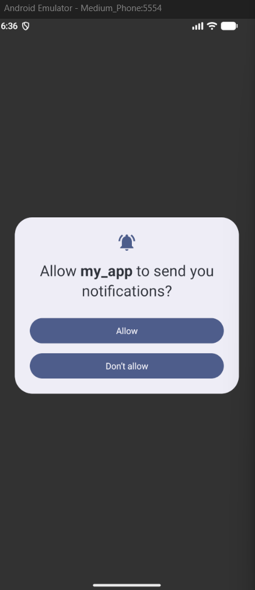
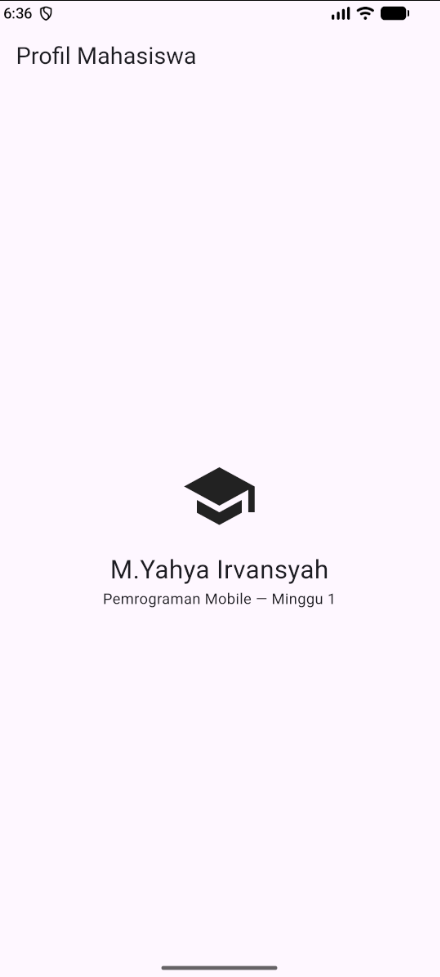
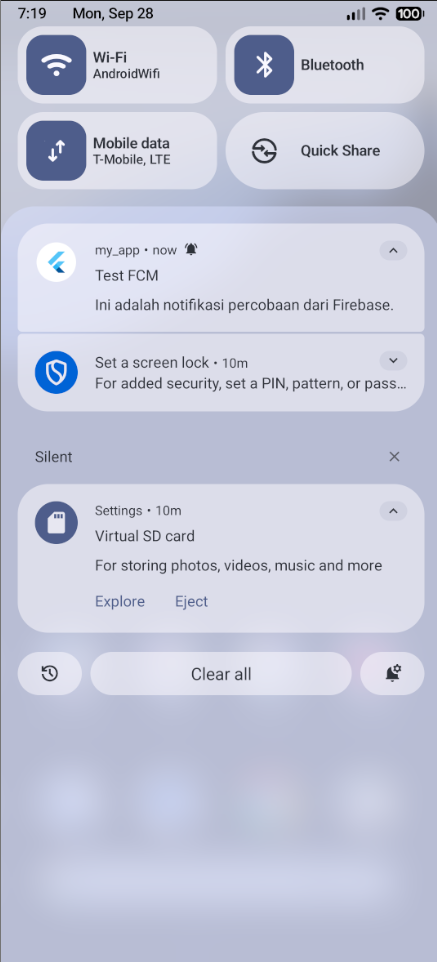

4. Uji kirim pertama dari Firebase Console
Buka Firebase Console -> Messaging -> buat campaign notifikasi percobaan.
Masukkan title dan body, targetkan aplikasi Android Anda.
Kirim saat aplikasi dalam state background: banner sistem harus muncul. Klik banner: aplikasi terbuka.
Catat hasilnya sebagai bukti screenshots/fcm-console-test.png.
